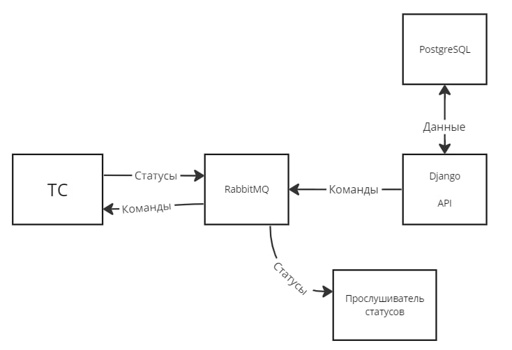

# vehicle-emulator

## ТЗ

### Реализовать сервис имитации транспортного средства.
Функциональные требования:
- Нужно реализовать API управления ТС (сущность с произвольными полями) - создать ТС, с указанным номером, удалить, отправить произвольную команду на ТС, получить список ТС, получить информацию по ТС. После выполнения какой-либо команды (установки какого-либо свойства ТС) должна быть возможность запросить значение этого свойства у ТС через API сервиса.
- Решение должно содержать интерфейс для асинхронного взаимодействия с ТС. Т.е. нужно иметь возможность передать любую команду на ТС и получить ответ о выполнении команды (MQ, callback).
- Реализовать режим поездки: начать/остановить/закончить движение на ТС (для начала движения нужно указать маршрут и скорость). После начала движения ТС должно начать репортить гео и скорость. По достижении финальной точки гео перестает меняться, скорость становится 0, но продолжает репортиться. В движении частота репорта раз в 1 секунду. В любом другом режиме раз в 10 секунд.
- Нужно иметь возможность изменить статус: взять в аренду, поставить на паузу, перевести в онлайн/оффлайн, доступен/не доступен для аренды, на обслуживании и т.д.
- Если ТС в оффлайн - на все операции с ТС возвращать ошибку. Также должны отсутствовать ответы на команды.

Не функциональные требования:
- Решение должно быть контейнеризировано и готово к запуску в  локальном docker (docker compose)
- Можно использовать один из языков на выбор: Python, Java, C#, GO
- Решение должно включать в себя API для управления ТС и любое приложение для отображения информации от ТС (консольное, веб и т.д.).
- Решение должно позволять создавать более одного ТС.

## Реализация
- имитация работы ТС реализована с помощью `asyncio`
- API и UI - `Django`
- MQ - `RabbitMQ`
- БД - `PostgreSQL`


## Запуск сервиса

```
cd vehicle-emulator/
docker-compose up -d
```

## Использование сервиса
Использовать сервис можно как с помощью API методов,
так и через web-интерфейс по адресу http://localhost:8000/  
Также есть и админка для управления данными моделей http://localhost:8000/admin/login

Смотреть присылаемые статусы от ТС можно в логах:
- файл `receiver/log/DEBUG.log` 
- через команду `docker logs whoosh-receiver`

## API методы
Описание методов доступно по http://localhost:8000/api/swagger или через коллекцию Postman
`Whoosh.postman_collection.json`

## Описание работы
Все операции по ТС запрещены, если оно оффлайн. Так же ТС прекращает вещать свой статус
Для корректной работы нужен .env файл в корне проекта

### Статусы аренды ТС
Предусмотрены следующие статусы аренды
- `Available` - Доступен для аренды
- `Not_available` - Не доступен для аренды
- `On_lease` - В аренде
- `Pause` - Пауза
- `Maintenance` - На обслуживании

### Режим поездки
Начать поездку можно только, если ТС в `Аренде`. Поездка не заканчивается, пока об этом не сообщить ТС.
Гео данные будут поступать и поле достижения места назначения


